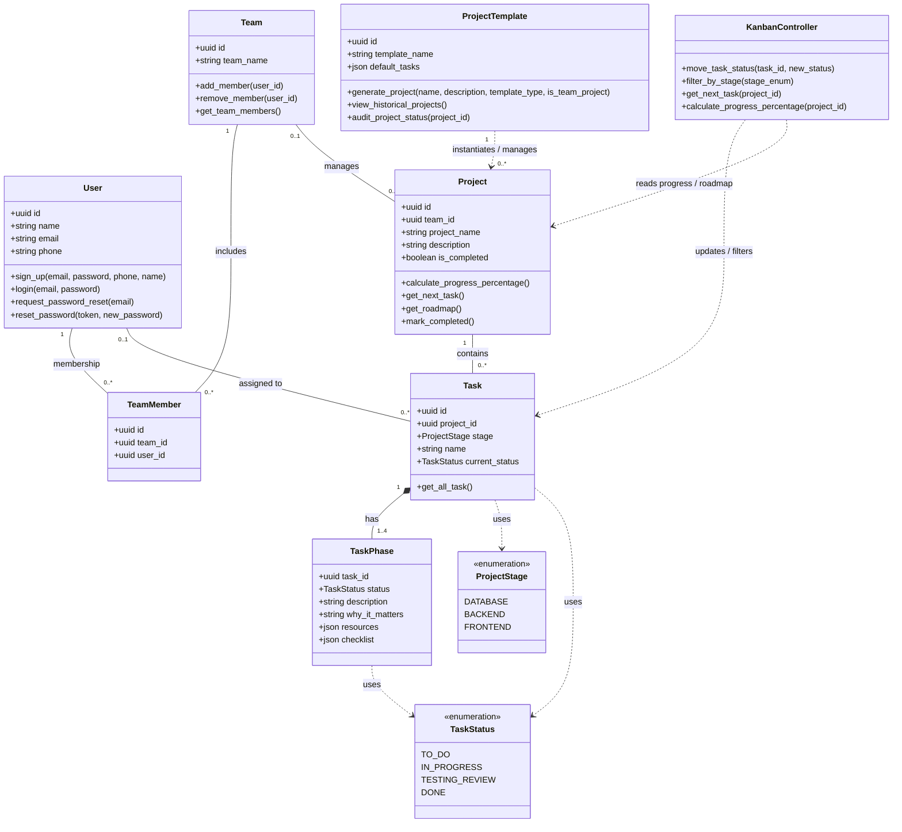

# Class Diagram

## Overview

## Diagram

```mermaid
classDiagram
class KanbanController {
        +move_task_status(task_id, new_status)
        +filter_by_stage(stage_enum)
        +get_next_task(project_id)
        +calculate_progress_percentage(project_id)
    }
    %% --- Data Entities & Active Record Models ---
    class User {
        +uuid id
        +string name
        +string email
        +string phone
        +sign_up(email, password, phone, name)
        +login(email, password)
        +request_password_reset(email)
        +reset_password(token, new_password)
    }

    class Team {
        +uuid id
        +string team_name
        +add_member(user_id)
        +remove_member(user_id)
        +get_team_members()
    }

    class TeamMember {
        +uuid id
        +uuid team_id
        +uuid user_id
    }

    class ProjectTemplate {
        +uuid id
        +string template_name
        +json default_tasks
        +generate_project(name, description, template_type, is_team_project)
        +view_historical_projects()
        +audit_project_status(project_id)
    }

    class Project {
        +uuid id
        +uuid team_id
        +string project_name
        +string description
        +boolean is_completed
        +calculate_progress_percentage()
        +get_next_task()
        +get_roadmap()
        +mark_completed()
    }

    class Task {
        +uuid id
        +uuid project_id
        +ProjectStage stage
        +string name
        +TaskStatus current_status
        +get_all_task()
    }

    class TaskPhase {
        +uuid task_id
        +TaskStatus status
        +string description
        +string why_it_matters
        +json resources
        +json checklist
    }

    %% --- Enumerations ---
    class ProjectStage {
        <<enumeration>>
        DATABASE
        BACKEND
        FRONTEND
    }

    class TaskStatus {
        <<enumeration>>
        TO_DO
        IN_PROGRESS
        TESTING_REVIEW
        DONE
    }

    %% --- Relationships & Multiplicities ---
    User "1" -- "0..*" TeamMember : membership
    Team "1" -- "0..*" TeamMember : includes
    ProjectTemplate "1" ..> "0..*" Project : instantiates / manages
    Team "0..1" -- "0..*" Project : manages
    Project "1" -- "0..*" Task : contains
    User "0..1" -- "0..*" Task : assigned to
    Task "1" *-- "1..4" TaskPhase : has

    Task ..> ProjectStage : uses
    Task ..> TaskStatus : uses
    TaskPhase ..> TaskStatus : uses
    KanbanController ..> Task : updates / filters
    KanbanController ..> Project : reads progress / roadmap
```

## Class Descriptions
